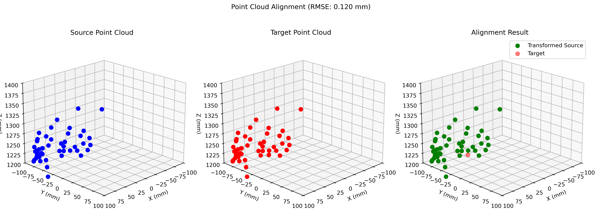

# Point Cloud Processing Tool

This Python project provides tools for processing and analyzing time-series 3D point cloud data, with a focus on computing transformations between consecutive frames using the Kabsch algorithm.

## Features

- Load and process time-series point cloud data from CSV files
- Compute rigid transformations (rotation and translation) between point clouds
- Handle missing or invalid points automatically
- Visualize point clouds and transformations in 3D
- Calculate alignment error metrics (RMSE)





## Requirements

The project requires Python 3.9+ and the following dependencies:
- NumPy
- Pandas
- Matplotlib

You can install the dependencies using either:

```bash
pip install -r requirements.txt
```

or using conda:

```bash
conda env create -f environment.yml
```

## Usage

### Basic Usage

```python
from point_cloud_processor import PointCloudProcessor

# Initialize the processor with a CSV file
processor = PointCloudProcessor('path/to/your/pointcloud.csv')

# Get point clouds at specific time points
cloud1 = processor.get_point_cloud_at_time(0)  # First frame
cloud2 = processor.get_point_cloud_at_time(1)  # Second frame

# Compute transformation between two frames
rotation, translation, error = processor.compute_transformation(0, 1)
```

### Data Format

The input CSV files should follow this structure:
1. First row: "Trajectories"
2. Second row: Number of frames
3. Third row: Point names/labels
4. Fourth row: Coordinate headers (X, Y, Z for each point)
5. Fifth row: Units (mm)
6. Subsequent rows: Frame data with X, Y, Z coordinates for each point

### Visualization

The project includes visualization tools to display:
- Original point clouds
- Transformed point clouds
- Overlay of source and target clouds for comparison

## Example

Check out `demo.py` for a complete example showing how to:
- Load point cloud data
- Compute transformations
- Visualize results

```python
python demo.py
```

## Implementation Details

### Point Cloud Processing

The `PointCloudProcessor` class handles:
- Data loading and preprocessing
- Point cloud manipulation
- Transformation computation using the Kabsch algorithm

### Transformation Computation

The transformation between point clouds is computed using:
1. Centroid alignment
2. SVD-based rotation computation
3. Translation determination
4. RMSE error calculation

### Visualization

The visualization module provides:
- 3D scatter plots of point clouds
- Multiple view angles
- Color-coded point sets
- Transparency options for overlaid visualizations
